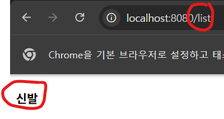

개인적으로 코딩(코드를 짜기전에)전에는 어떻게 만들것인지
설계를 해놓고 가는게 좋은것 같다. 그럼 순서대로 천천히 만들면 되니깐
비교적 덜 어렵지않다.
이번에는 상품리스트를 만들건데 상품리스트를 어떻게 만들지 생각해보는거다.
전 포스팅에서 웹서버와 웹페이지를 연결해서 만든것처럼 똑같이 만들면 된다.
그럼 이번에는 /list로 접속하면 list.html을 전송해줘서 상품리스트가 보이게
만들어보자.


## 상품목록페이지 만들기

```java
package com.example.demo;

import org.springframework.stereotype.Controller;
import org.springframework.ui.Model;
import org.springframework.web.bind.annotation.GetMapping;

@Controller
public class ProductController {

    @GetMapping("/list")
    String list(Model model) {
        model.addAttribute("name", "신발");
        return "list.html";
    }

}
```
일단 상품을 보여줄거라서 ProductConroller라고 class를 하나 만들었다.
위의 코드는 /list URL로 GET메소드 요청날리면 list.html 보여주세요 이 뜻인데
못보던 코드가 있다 model.addAttribute("name", "신발"); 이게 뭔지 한번 알아보자.

## HTML에 서버 데이터 넣어서 보내주기(Thymeleaf 템플릿엔진)

만약에 쇼핑몰 상품이 100만갠데 

```html
<div>
  
  <h4>신발</h4>
  <p>4900</p>
</div>
<div>
  
  <h4>자켓</h4>
  <p>9900</p>
</div>
```

위의처럼 100만개를 수동으로 타이핑 하는건 불가능하다.
그래서 이럴떄는 Thymeleaf문법을 쓰면 간단하다.

## Thymeleaf 사용법
1. 파라미터() 안에 Model model
2. model.addAttribute("전달한데이터이름","데이터");
3. html파일에서 th:text="${전달할데이터이름}" 

이렇게 해주면 된다

```html
<!DOCTYPE html>
<html lang="en">

<head>
    <meta charset="UTF-8">
    <meta name="viewport" content="width=device-width, initial-scale=1.0">
    <title>Document</title>
</head>

<body>
    <h4 th:text="${name}">상품</h4>
</body>
</html>
```

이렇게하면 위에 상품대신 맨 위의 코드에서 작성한대로(model.addAttribute("name", "신발");)
상품  >>> 신발로 바뀐다.
한번 진짜로 바뀌나 http://localhost:8080/list 에 접속해서 확인해보자
